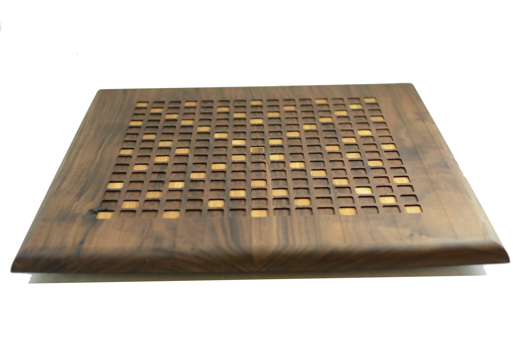

# scrabble_board

Find the instructions for making this board at: http://www.instructables.com/id/Hardwood-CNC-Scrabble-Board/

CAD files:
* scrabble_board.iges/f3d defines the main game board
* base_plate.iges/f3d defines the plywood base that holds the turntable

Laser cutting:
* pattern insets.ai/.dxf defines inlays for the special tiles
* tiles.ai defines/.dxf the letter tiles 

GCode:
* walnut_gcode folder holds gcode for cutting the main board in ~.8" hardwood
* plywood_gcode folder holds gcode for cutting test of main board in ~.75" plywood
* baseplate_gcode folder holds gcode for cutting the base plate in ~.5" plywood